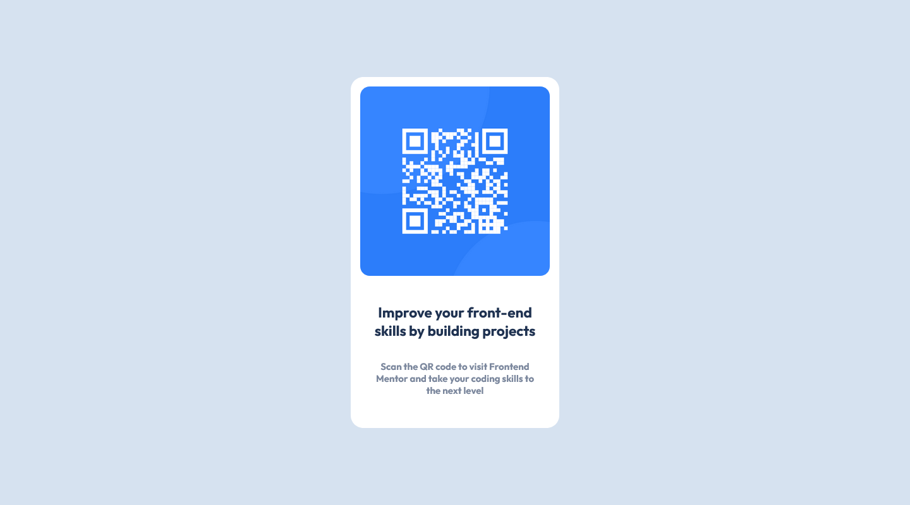

# Frontend Mentor - QR code component solution

This is a solution to the [QR code component challenge on Frontend Mentor](https://www.frontendmentor.io/challenges/qr-code-component-iux_sIO_H). Frontend Mentor challenges help you improve your coding skills by building realistic projects. 

## Table of contents

- [Overview](#overview)
  - [Screenshot](#screenshot)
  - [Links](#links)
- [My process](#my-process)
  - [Built with](#built-with)
  - [What I learned](#what-i-learned)
  - [Continued development](#continued-development)
  - [Useful resources](#useful-resources)
- [Author](#author)
- [Acknowledgments](#acknowledgments)

## Overview

### Screenshot

### Links

- Solution URL: [https://github.com/sagid654/QR-Code]
- Live Site URL: [https://sagid654.github.io/QR-Code/]

## My process

### Built with

- Semantic HTML5 markup
- CSS custom properties
- Flexbox

### What I learned

I Learned how to adjusting things only with my eyes without any properties.

### Continued development

I would like to make a landing page and make sharp & circle for the images.

### Useful resources

## Author

- Frontend Mentor - [@sagid654](https://www.frontendmentor.io/profile/sagid654)

## Acknowledgments
